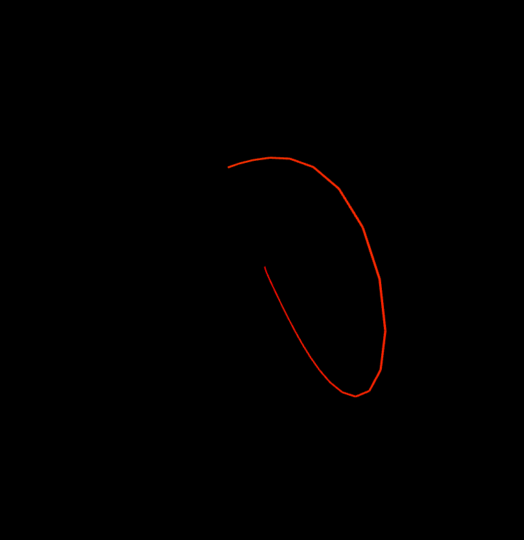

# Lorenz Attractor

## Introduction

Lorenz Attractor is a simulation made from a simple set of differential equations which result in a non-linear dynamic system. It is famous for its chaotic behavior, in that a small change in the system can result in a large change in the output. This is also known as the butterfly effect.
The differential equations are as follows:

`dx/dt = sigma * (y - x)`

`dy/dt = x * (rho - z) - y`

`dz/dt = x * y - beta * z`

where sigma, rho and beta are constants. We can change these constants to get different outputs.

Some of the interesting properties of the Lorenz Attractor are:

1. The attractor is invariant under the group of three-dimensional rotations.
2. The attractor is a fractal.
3. The attractor is chaotic.
4. The Lyapunov exponent, which is a measure of how fast two nearby states diverge, is positive for the Lorenz attractor. This means that nearby states diverge exponentially fast.

We can use the following values for the constants to get the following outputs:

1. `sigma = 10`, `rho = 28`, `beta = 8/3`
2. `sigma = 10`, `rho = 99.96`, `beta = 8/3`
3. `sigma = 10`, `rho = 99.96`, `beta = 2/3`
4. `sigma = 10`, `rho = 99.96`, `beta = 1/3`
5. `sigma = 10`, `rho = 99.96`, `beta = 0`

## Installation

To run the simulation, simply clone the repository and open the `index.html` file in your browser. Alternatively, you can visit the [GitHub Pages](https://ghostscypher.github.io/lorenz_attractor/src/index.html) for this repository.

## Implementation

The implementation is pretty simple and straightforward. We create a point in 3D space and then use the differential equations to update the position of the point. We then draw a line from the previous position to the new position. We repeat this process for a given number of iterations, in my case the simulation will go on indefinitely.

## Demo

## References

1. [Lorenz Attractor](https://en.wikipedia.org/wiki/Lorenz_system)
2. [Fractals](https://en.wikipedia.org/wiki/Fractal)
3. [P5 JS](https://p5js.org/)
4. [P5 JS Reference](https://p5js.org/reference/)
5. [P5 JS Examples](https://p5js.org/examples/)
6. [P5 JS Web Editor](https://editor.p5js.org/)
7. [Coding train - P5 JS Tutorials](https://www.youtube.com/user/shiffman/playlists?view=50&sort=dd&shelf_id=14)
8. [The Nature of Code](https://natureofcode.com/)
9. [The Coding Train](https://thecodingtrain.com/)
10. [The Coding Train - Lorenz Attractor](https://www.youtube.com/watch?v=f0lkz2gSsIk)